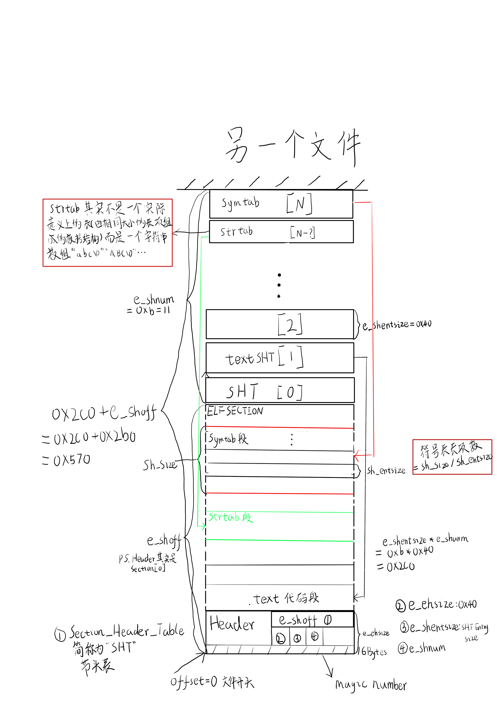

# 4月报

## Day.16
这是Day.17补的。

今天画了字符串解析状态机的状态迁移图、指令解析状态迁移图、操作数解析状态迁移图、内存操作数状态迁移图。画完了图，代码就很清晰了，有了这几个状态机，后续的汇编指令可以直接使用字符串来构建。

今天还感悟到一个东西：虚拟机的实现。

我们将cpu和内存抽象出来，用一些结构体变量来表示，cpu由一堆寄存器组成，内存直接就是一个大数组，仅仅这两个东西就可以组成最简单的虚拟机。寄存器变量模拟寄存器，保存单个数据(uint64_t)，并且通过`va2pa()`可以将寄存器变量中保存的虚拟地址转换到内存数组的实际下标。

首先将汇编指令写到内存数组中，然后寄存器去访问内存并读取指令，解析运行后移动指令指针（下一条或者跳转）,这样循环起l来，就是一个最简单的虚拟机了。

## Day.17

今天看完了CSAPP的第三章，对计算机的指令执行体系有了新的认知。

相比于昨天的内容，今天主要是实现了一下汇编指令。`mov call ret push pop` 这几个是前几节课里面讲过的，之前没有写这次补上了，`mov push pop`都是为了某些实验指令特定实现的，参数不通用。`add sub leave jmp jne`这是今天新讲的，涉及到cpu标志位，使用一个`union`+ `struct`实现，可以节省内存，方便清零。其中的`OF`标志格外需要注意，需要推导一下各种溢出情况：同号才会溢出，同号又有两种情况。

这些实现完了，微型虚拟机就完成了（大佬也说这个像虚拟机，我居然猜对了）。

链接开了个头，比较模糊，感觉挺像设计数据存储的，也有magic number之类的，明天好好总结一下。

## Day.18
今天是ELF的第一节课，直接看懵了，符号表好难。

首先，ELF(Excutable Linkable Format)就是常见的`.o`的目标文，使用`gcc -c` 可以获得。这个东西是一个二进制文件，阳明佬准备用txt的文本格式去模拟这个东西，从而实现一个自己的简易链接器（静态的）。


上图是ELF文件的结构，从header开始，可以找到SHT，然后根据SHT可以索引到真正的SECTION，gcch以及shell等软件会将这个elf文件加载到内存中，这些SECTION就构成了诸如内存结构中的`代码段`、`数据段`、`.bss段`等区域。这里面最重要的就是一个被称为`符号表(symbol table)`的段，这个和编译原理有些关系，就是将代码中的各种全局变量、函数的`属性`保存在这里。

- bind GLOBAL 
  - 全局的(默认) 
  - LOCAL 局部的(static) 
  - WEAK 弱符号的 (`__attribute__((weak))`)

- type 
  - OBJECT 变量 
  - FUNCTION 函数 
  - NOTYPE(extern且未初始化的变量 extern且未定义的函数)

- index_name 
  - .data(初始化过的变量 **初始化为0不算**) 
  - .bss(未初始化的 **初始化为0放在这个段**) 
  - COMMON(不知道该放在.data还是.bss的悬而未决段)
  - .text(函数)

开始写代码了，先定义了一下上面提到过的数据结构，然后声明了几个函数。希望写完代码能对链接有一个比较清晰的认知。

明天要去青城山玩两天，日报要鸽一下。

## Day.23

今天搞毕设，对接了一下前端的小伙伴，直接不用看es了，小伙伴帮我过滤查询结果：）。在做文件hash计算的时候，前端那边不太能处理Binary，就搞了一下进制转换弄成了Hex。缩略图暂时放弃了，但是论文里还是得水的：）。小伙伴提到用经纬度进行文件定位，把原本的path更换成了location，具体的查询还是前端对全量数据的过滤。原本准备写一下Dynamic Array，估计得明天了。

## Day.24

学习了一下Emacs-Lisp的简单使用
``` emacs-lisp
;; This buffer is for text that is not saved, and for Lisp evaluation.
;; To create a file, visit it with C-x C-f and enter text in its buffer.
(+3 (+1 2))

(defun hello(name)(insert "Hello "name))
(hello "you")
(hello "eintr")
)
(progn
(switch-to-buffer-other-window "*test")
(hello "you"))

(progn
(switch-to-buffer-other-window "*test")
(erase-buffer)
(hello "there"))

(progn
(switch-to-buffer-other-window "*test")
(erase-buffer)
(hello "you")
(other-window 1))

(let ((local-name "eintr"))
(switch-to-buffer-other-window "*test")
(erase-buffer)
(hello local-name)
(other-window 1))

(format "Hello %s!\n" "eintr")

(defun hello(name)
(insert (format "Hello %s!\n" name)))

(hello "eintr")

(defun greeting(name)
(let ((your-name "eintr"))
  (insert(format "\nHello %s!\nI am %s."
		 name
		 your-name))))
(greeting "impact")
Hello impact!
I am eintr.

(defun greeting(from-name)
(let ((your-name (read-from-minibuffer "Enter your name:")))
  (insert(format "\nHello %s!\nI am %s."
		 from-name
		 your-name))))
(greeting "eintr")
Hello eintr!
I am impact.

(defun greeting(from-name)
(let ((your-name (read-from-minibuffer "Enter your name:")))
  (switch-to-buffer-other-window "*test")
  (erase-buffer)
  (insert(format "\nHello %s!\nI am %s."
		 from-name
		 your-name))
  (other-window 1)))

(greeting "you")


(setq list-of-names '("eintr" "song" "impact"))

(mapcar 'hello list-of-names)Hello eintr!
Hello song!
Hello impact!


(defun greeting()
  (switch-to-buffer-other-window "*test")
  (erase-buffer)
  (mapcar `hello list-of-names)
  (other-window 1))

(greeting)

(defun hello-to-hi()
(switch-to-buffer-other-window "*test")
(erase-buffer)
(mapcar 'hello list-of-names)
(goto-char (point-min))
(while (search-forward "Hello" nil t)
(replace-match "Hi"))
(other-window 1))

(hello-to-hi)

(defun boldify-names()
(switch-to-buffer-other-window "*another buffer")
(goto-char (point-min))
(while (re-search-forward "Hi \\(.+\\)!" nil t)
  (add-text-properties (match-beginning 1)
		       (match-end 1)
		       (list 'bold)))
(other-window 1))
```

把dynamic array写了一下，没啥特殊的allocate/free 对应的内存需要的时候容量翻倍。

把double linked list 写了一下，感受了一下c的面向对象编程，即用在结构体定义中仅仅使用函数指针，在使用子类实现的时候则使用local的函数进行初始化。

基类 或者 这个应该叫接口更合适一点

``` c++
typedef struct
{
    uint64_t (*construct_node)();
    int (*destruct_node)(uint64_t);

    int (*is_null_node)(uint64_t);

    int (*compare_nodes)(uint64_t, uint64_t);

    uint64_t (*get_node_prev)(uint64_t);
    int (*set_node_prev)(uint64_t, uint64_t);

    uint64_t (*get_node_next)(uint64_t);
    int (*set_node_next)(uint64_t, uint64_t);

    uint64_t (*get_node_value)(uint64_t);
    int (*set_node_value)(uint64_t, uint64_t);
} linkedlist_node_interface;

```

派生类 或者叫 实现
``` c++
void linkedlist_validate_interface(linkedlist_node_interface *i_node, uint64_t flags) {...}

static int is_null_node(uint64_t node_id) {...}

static uint64_t construct_node() {...}

static int destruct_node(uint64_t node_id) {...}

static int compare_nodes(uint64_t first, uint64_t second) {...}

static uint64_t get_node_prev(uint64_t node_id) {...}

static int set_node_prev(uint64_t node_id, uint64_t prev_id) {...}

static uint64_t get_node_next(uint64_t node_id) {...}

static int set_node_next(uint64_t node_id, uint64_t next_id) {...}

static uint64_t get_node_value(uint64_t node_id) {...}

static int set_node_value(uint64_t node_id, uint64_t value) {...}


static linkedlist_node_interface i_node =
{
    .construct_node = &construct_node,
    .destruct_node = &destruct_node,
    .is_null_node = &is_null_node,
    .compare_nodes = &compare_nodes,
    .get_node_prev = &get_node_prev,
    .set_node_prev = &set_node_prev,
    .get_node_next = &get_node_next,
    .set_node_next = &set_node_next,
    .get_node_value = &get_node_value,
    .set_node_value = &set_node_value
};

```

## Day.25
今天继续写论文，有点难搞，要把blog改成文邹邹的论文，感觉自己都不会说人话了。
